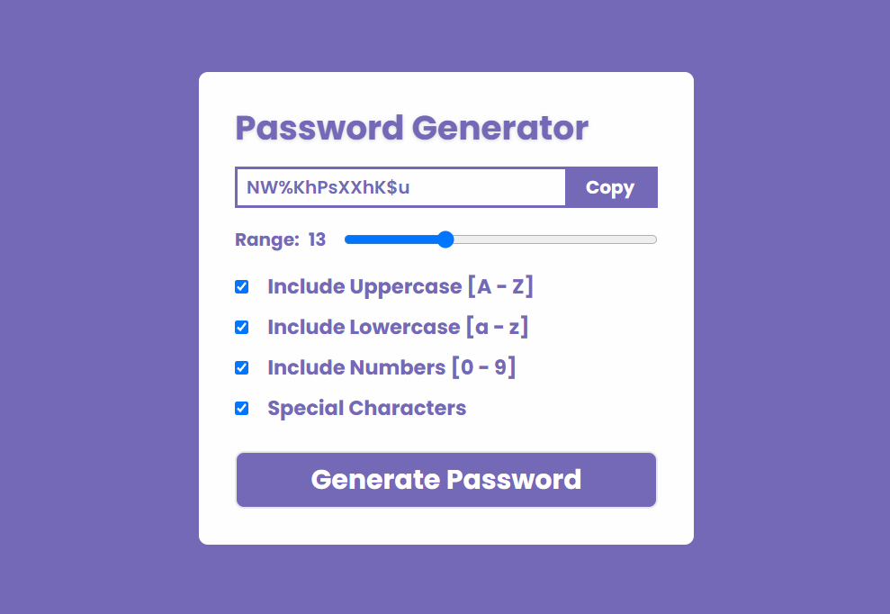

# Password Generator

A simple and responsive password generator built with React and Tailwind CSS. This application allows users to generate random passwords with customizable options such as including uppercase letters, lowercase letters, numbers, and special characters.

## Link

You can access the deployed application [here](https://password-generator-vinaykollikani.netlify.app/).

## Screenshot



## Installation

1. **Clone the repository:**
   ```bash
   git clone https://github.com/your-username/password-generator.git
   cd password-generator
   ```

2. **Install dependencies:**
   ```bash
   npm install
   ```

3. **Start the development server:**
   ```bash
   npm start
   ```

## Usage

1. Open the application in your browser.
2. Use the range slider to set the desired password length.
3. Select the character sets to include: uppercase letters, lowercase letters, numbers, and special characters.
4. Click the "Generate Password" button to generate a new password.
5. Click the "Copy" button to copy the generated password to your clipboard.


## Contributing

Contributions are welcome! Please open an issue or submit a pull request for any improvements or bug fixes.
